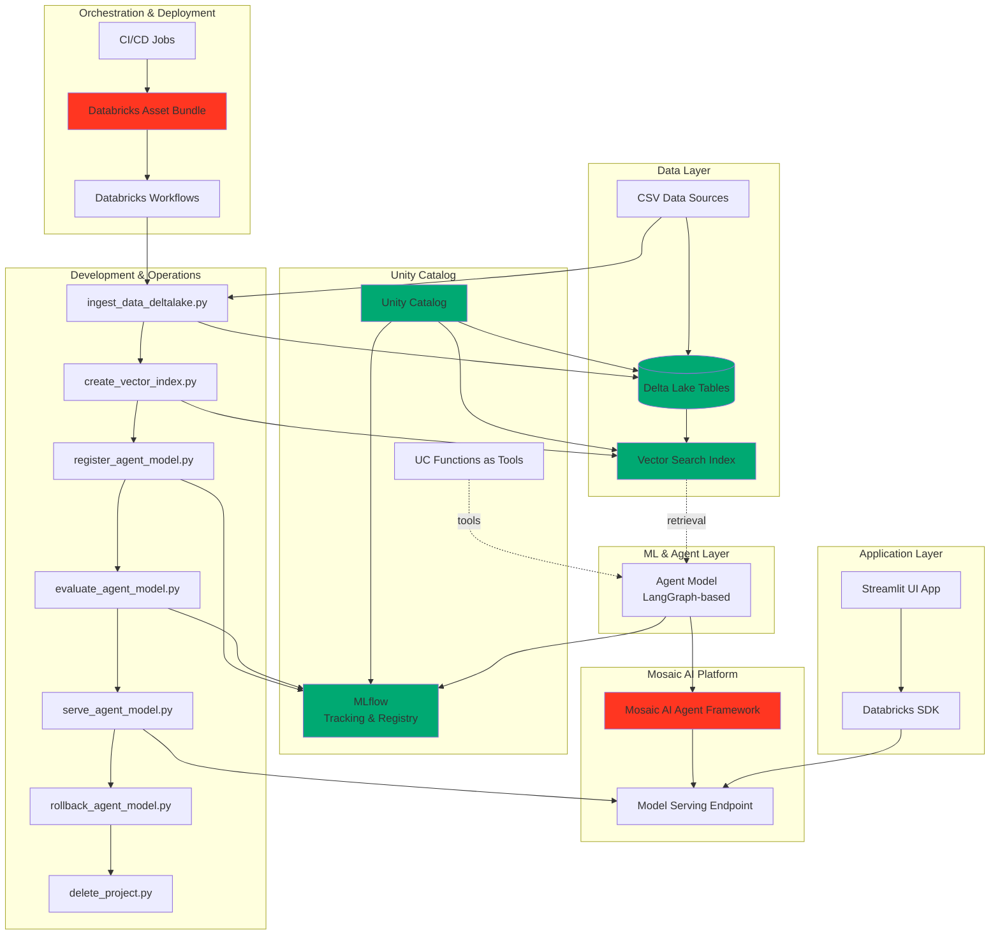

# Electronics Agent System - Consolidated Architecture & Summary

## Architecture Diagram



## Consolidated Summary

### Project Overview
The **Electronics Agent System** is a production-ready, enterprise-grade AI agent platform built on the latest Databricks GenAI stack. It manages electronic component data through intelligent RAG (Retrieval-Augmented Generation) capabilities, featuring full MLOps lifecycle management, version control, and automated deployment pipelines.

### Technology Stack

#### Core Databricks Components
- **Unity Catalog**: Centralized governance for data, models, and functions with fine-grained access control
- **Delta Lake**: ACID-compliant data lake with liquid clustering optimization and change data feed capabilities
- **Vector Search**: Managed vector database for semantic similarity search with auto-sync capabilities
- **MLflow**: Experiment tracking, model registry, and lifecycle management
- **Databricks SDK**: Python API for programmatic interaction with Databricks services

#### AI/ML Framework
- **LangGraph**: Orchestrates complex agent workflows with state management
- **Mosaic AI Agent Framework**: Enterprise-grade agent deployment and management
- **UC Functions as Tools**: Registered Unity Catalog functions serve as callable tools for agents
- **Agents as Models**: Agents packaged and versioned as MLflow models

#### DevOps & Deployment
- **Databricks Asset Bundles (DAB)**: Infrastructure-as-code for resource management via `databricks.yml`
- **CI/CD Workflows**: Automated pipelines for validation, deployment, and testing
- **Databricks Workflows**: Orchestrates data ingestion, indexing, training, evaluation, and serving jobs

### System Architecture

#### Data Pipeline
1. **Ingestion**: CSV files → Delta Lake tables (via `ingest_data_deltalake.py`)
2. **Indexing**: Delta Lake → Vector Search indexes (via `create_vector_index.py`)
3. **Optimization**: Liquid clustering and change data feed for performance

#### Agent Lifecycle
1. **Development**: Agent model defined using LangGraph with UC Functions as tools (`agent_model.py`)
2. **Registration**: Model registered to MLflow with Unity Catalog integration (`register_agent_model.py`)
3. **Evaluation**: Performance testing against predefined Q&A pairs (`evaluate_agent_model.py`)
4. **Deployment**: Model served via Databricks Model Serving endpoints (`serve_agent_model.py`)
5. **Versioning**: Rollback capabilities for model versions (`rollback_agent_model.py`)

#### Application Layer
- **Streamlit UI** (`app.py`): Interactive chat interface for end-users
- **Databricks SDK**: Handles API communication between UI and model serving endpoints
- **Session Management**: Persistent chat history and conversation tracking

### Key Features

**MLOps Capabilities**
- Automated model versioning and tracking
- A/B testing and canary deployments via serving endpoints
- Rollback to previous model versions
- Comprehensive evaluation framework
- Metric logging and monitoring

**Governance & Security**
- Unity Catalog-based access controls
- Audit logging for data and model access
- Secure credential management
- Project isolation and resource management

**Operational Excellence**
- Infrastructure-as-code deployment
- Automated CI/CD pipelines
- Project documentation generation (`document_project.py`)
- Complete resource cleanup (`delete_project.py`)
- Environment reproducibility via `requirements.txt` and `setup.py`

### Deployment Workflow

Using Databricks Asset Bundles, the system supports:
1. **Validation**: `databricks bundle validate`
2. **Deployment**: `databricks bundle deploy -t dev`
3. **Testing**: Automated evaluation jobs
4. **Serving**: Model endpoint activation
5. **Monitoring**: MLflow tracking and metrics
6. **Rollback**: Version control with one-command rollback
7. **Cleanup**: `databricks bundle destroy`

### Project Structure
The package follows Python best practices with modular components, clear separation of concerns, and comprehensive tooling for the complete agent lifecycle—from data ingestion through production deployment and maintenance.


# DEMO: GenAI Agent Platform for Electronic Components

The **Electronics** project is a production-ready Python package for managing, deploying, and scaling agentic AI models on the **Databricks Mosaic AI** platform. It utilizes a state-of-the-art stack including **LangGraph** for orchestration, **Unity Catalog (UC)** for governance, and **Databricks Asset Bundles (DABs)** for CI/CD.

## 🏗️ Architecture Overview

The system follows a modular "Agent-as-a-Model" architecture governed by Unity Catalog:

1.  **Data Layer**: Raw CSVs ingested into **Delta Lake** with Liquid Clustering.
2.  **Retrieval Layer**: **Databricks Vector Search** provides semantic retrieval over the ingested data.
3.  **Agent Logic**: **LangGraph** orchestrates the reasoning loop, using **UC Functions** as tools for real-time data access.
4.  **Ops/MLOps**: Managed via **MLflow** for tracking and **Databricks Asset Bundles (DABs)** for multi-environment deployment.
5.  **Interface**: A **Streamlit** application consuming a **Mosaic AI Model Serving** endpoint.

---

## 🛠️ Tech Stack & Components

| Component | Technology | Description |
| :--- | :--- | :--- |
| **Governance** | [Unity Catalog](https://www.databricks.com) | Centralized management of Delta tables, Volumes, and UC Functions. |
| **Orchestration**| [LangGraph](https://www.langchain.com) | Stateful, multi-turn agent logic and tool-calling flows. |
| **Agent Tooling** | [UC Functions](https://docs.databricks.com) | Python/SQL functions in UC registered as tools for the agent. |
| **Model Tracking**| [MLflow](https://mlflow.org) | Versioning for LangGraph agents and evaluation metrics. |
| **Serving** | [Mosaic AI Model Serving](https://www.databricks.com) | Low-latency endpoint hosting the agent as a model. |
| **Infrastructure**| [Databricks Asset Bundles (DABs)](https://docs.databricks.com) | Infrastructure-as-code for CI/CD and Workflow orchestration. |

---

## 🚀 Execution Workflow

1.  **Data Ingestion**: `ingest_data_deltalake.py` streams CSV data into Delta Lake and triggers `create_vector_index.py` to sync embeddings.
2.  **Development**: `agent_model.py` defines the LangGraph logic, incorporating `utils.py` for config management.
3.  **Registration**: `register_agent_model.py` logs the agent to MLflow and registers it in Unity Catalog as a Model.
4.  **Deployment**: The `databricks.yml` bundle automates the creation of Model Serving endpoints via `serve_agent_model.py`.
5.  **Evaluation**: `evaluate_agent_model.py` runs systematic tests against the endpoint to ensure accuracy.
6.  **UX**: Users interact with the agent through `app.py` (Streamlit), which provides a governed chat interface.

---

## 📂 Project Structure

- `source_pkg/`: Core logic including the `agent_model.py` and tool definitions.
- `databricks.yml`: The primary DAB configuration for CI/CD jobs and resources.
- `ingest/`: Scripts for Delta Lake and Vector Search maintenance.
- `deployment/`: Scripts for serving, registration, and version rollbacks.
- `tests/`: Evaluation and unit testing for agent responses.

---

## 🔧 Deployment Commands

Manage the project lifecycle using the [Databricks CLI](https://docs.databricks.com):

```bash
# Validate the bundle configuration
databricks bundle validate --target dev

# Deploy the stack to the dev environment
databricks bundle deploy --target dev

# Run the app UI
databricks bundle run app-ui --target dev 

