# DEMO - GenAI RAG system using Databricks 

## Architecture Diagram

```mermaid
graph TB
    subgraph "Data Layer"
        CSV[📄 CSV Data Sources] --> DeltaLake[(🗄️ Delta Lake Tables)]
        DeltaLake --> VectorSearch[🔍 Vector Search Index]
    end
    
    subgraph "Unity Catalog"
        UC[🏛️ Unity Catalog]
        UCFunctions[⚙️ UC Functions as Tools]
        UC --> DeltaLake
        UC --> MLFlow
        UC --> VectorSearch
    end
    
    subgraph "ML & Agent Layer"
        AgentModel[🤖 Agent Model<br/>LangGraph-based]
        MLFlow[📊 MLflow<br/>Tracking & Registry]
        AgentModel --> MLFlow
        VectorSearch -.retrieval.-> AgentModel
        UCFunctions -.tools.-> AgentModel
    end
    
    subgraph "Mosaic AI Platform"
        MosaicAgent[✨ Mosaic AI Agent Framework]
        ModelServing[🚀 Model Serving Endpoint]
        AgentModel --> MosaicAgent
        MosaicAgent --> ModelServing
    end
    
    subgraph "Orchestration & Deployment"
        DAB[📦 Databricks Asset Bundle]
        Workflows[⚡ Databricks Workflows]
        CICD[🔄 CI/CD Jobs]
        DAB --> Workflows
        CICD --> DAB
    end
    
    subgraph "Application Layer"
        Streamlit[💬 Streamlit UI App]
        API[🔌 Databricks SDK]
        Streamlit --> API
        API --> ModelServing
    end
    
    subgraph "Development & Operations"
        Ingest[📥 ingest_data_deltalake.py]
        CreateIndex[🔨 create_vector_index.py]
        Register[📝 register_agent_model.py]
        Evaluate[✅ evaluate_agent_model.py]
        Serve[🌐 serve_agent_model.py]
        Rollback[⏮️ rollback_agent_model.py]
        Delete[🗑️ delete_project.py]
    end
    
    Workflows --> Ingest
    Ingest --> CreateIndex
    CreateIndex --> Register
    Register --> Evaluate
    Evaluate --> Serve
    Serve --> Rollback
    Rollback --> Delete
    
    CSV --> Ingest
    Ingest --> DeltaLake
    CreateIndex --> VectorSearch
    Register --> MLFlow
    Evaluate --> MLFlow
    Serve --> ModelServing
    
    style CSV fill:#e3f2fd,stroke:#1976d2,stroke-width:2px,color:#000
    style DeltaLake fill:#c8e6c9,stroke:#388e3c,stroke-width:3px,color:#000
    style VectorSearch fill:#fff9c4,stroke:#f57c00,stroke-width:2px,color:#000
    
    style UC fill:#00a972,stroke:#006b4d,stroke-width:3px,color:#fff
    style UCFunctions fill:#4db6ac,stroke:#00897b,stroke-width:2px,color:#fff
    
    style AgentModel fill:#ce93d8,stroke:#8e24aa,stroke-width:3px,color:#000
    style MLFlow fill:#81c784,stroke:#388e3c,stroke-width:3px,color:#000
    
    style MosaicAgent fill:#ff3621,stroke:#c62828,stroke-width:3px,color:#fff
    style ModelServing fill:#ff7043,stroke:#d84315,stroke-width:3px,color:#fff
    
    style DAB fill:#ff6f00,stroke:#e65100,stroke-width:3px,color:#fff
    style Workflows fill:#ffa726,stroke:#f57c00,stroke-width:3px,color:#000
    style CICD fill:#ffb74d,stroke:#fb8c00,stroke-width:2px,color:#000
    
    style Streamlit fill:#90caf9,stroke:#1976d2,stroke-width:3px,color:#000
    style API fill:#64b5f6,stroke:#1565c0,stroke-width:2px,color:#fff
    
    style Ingest fill:#b39ddb,stroke:#5e35b1,stroke-width:2px,color:#000
    style CreateIndex fill:#9fa8da,stroke:#3949ab,stroke-width:2px,color:#000
    style Register fill:#81d4fa,stroke:#0277bd,stroke-width:2px,color:#000
    style Evaluate fill:#80cbc4,stroke:#00695c,stroke-width:2px,color:#000
    style Serve fill:#a5d6a7,stroke:#2e7d32,stroke-width:2px,color:#000
    style Rollback fill:#ffcc80,stroke:#ef6c00,stroke-width:2px,color:#000
    style Delete fill:#ef9a9a,stroke:#c62828,stroke-width:2px,color:#000
```



### Project Overview
The **Electronics Agent System** is a production-ready, enterprise-grade AI agent platform built on the latest Databricks GenAI stack. It manages electronic component data through intelligent RAG (Retrieval-Augmented Generation) capabilities, featuring full MLOps lifecycle management, version control, and automated deployment pipelines.

### Technology Stack

#### Core Databricks Components
- **Unity Catalog**: Centralized governance for data, models, and functions with fine-grained access control
- **Delta Lake**: ACID-compliant data lake with liquid clustering optimization and change data feed capabilities
- **Vector Search**: Managed vector database for semantic similarity search with auto-sync capabilities
- **MLflow**: Experiment tracking, model registry, and lifecycle management
- **Databricks SDK**: Python API for programmatic interaction with Databricks services

#### AI/ML Framework
- **LangGraph**: Orchestrates complex agent workflows with state management
- **Mosaic AI Agent Framework**: Enterprise-grade agent deployment and management
- **UC Functions as Tools**: Registered Unity Catalog functions serve as callable tools for agents
- **Agents as Models**: Agents packaged and versioned as MLflow models

#### DevOps & Deployment
- **Databricks Asset Bundles (DAB)**: Infrastructure-as-code for resource management via `databricks.yml`
- **CI/CD Workflows**: Automated pipelines for validation, deployment, and testing
- **Databricks Workflows**: Orchestrates data ingestion, indexing, training, evaluation, and serving jobs

### System Architecture

#### Data Pipeline
1. **Ingestion**: CSV files → Delta Lake tables (via `ingest_data_deltalake.py`)
2. **Indexing**: Delta Lake → Vector Search indexes (via `create_vector_index.py`)
3. **Optimization**: Liquid clustering and change data feed for performance

#### Agent Lifecycle
1. **Development**: Agent model defined using LangGraph with UC Functions as tools (`agent_model.py`)
2. **Registration**: Model registered to MLflow with Unity Catalog integration (`register_agent_model.py`)
3. **Evaluation**: Performance testing against predefined Q&A pairs (`evaluate_agent_model.py`)
4. **Deployment**: Model served via Databricks Model Serving endpoints (`serve_agent_model.py`)
5. **Versioning**: Rollback capabilities for model versions (`rollback_agent_model.py`)

#### Application Layer
- **Streamlit UI** (`app.py`): Interactive chat interface for end-users
- **Databricks SDK**: Handles API communication between UI and model serving endpoints
- **Session Management**: Persistent chat history and conversation tracking

### Key Features

**MLOps Capabilities**
- Automated model versioning and tracking
- A/B testing and canary deployments via serving endpoints
- Rollback to previous model versions
- Comprehensive evaluation framework
- Metric logging and monitoring

**Governance & Security**
- Unity Catalog-based access controls
- Audit logging for data and model access
- Secure credential management
- Project isolation and resource management

**Operational Excellence**
- Infrastructure-as-code deployment
- Automated CI/CD pipelines
- Project documentation generation (`document_project.py`)
- Complete resource cleanup (`delete_project.py`)
- Environment reproducibility via `requirements.txt` and `setup.py`

### Deployment Workflow

Using Databricks Asset Bundles, the system supports:
1. **Validation**: `databricks bundle validate`
2. **Deployment**: `databricks bundle deploy -t dev`
3. **Testing**: Automated evaluation jobs
4. **Serving**: Model endpoint activation
5. **Monitoring**: MLflow tracking and metrics
6. **Rollback**: Version control with one-command rollback
7. **Cleanup**: `databricks bundle destroy`

## 🔧 Deployment Commands

Manage the project lifecycle using the [Databricks CLI](https://docs.databricks.com):

```bash
# Validate the bundle configuration
databricks bundle validate --target dev

# Deploy the stack to the dev environment
databricks bundle deploy --target dev

# Run the app UI
databricks bundle run app-ui --target dev 

